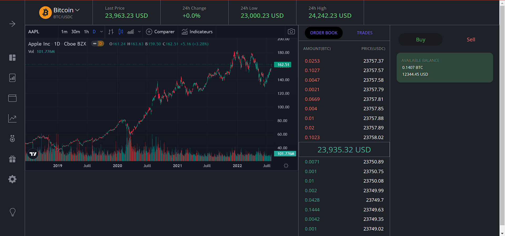

### Krypto Assesement 2

#### Submission by Neelesh Ranjan Jha-19BCE1645

#### Instruction to Run
- npm i
- npm start
- You can view the webpage at localhost:3000

### Features Implemented
- Dynamic Order Book
- Chart

### Future work if more time
- Increasing decreasing bar according to price
- Full Implemention of the UI
- Switching b/w dark and light modes
- Ability to switch coins
- Responsiveness

### Screenshots-
